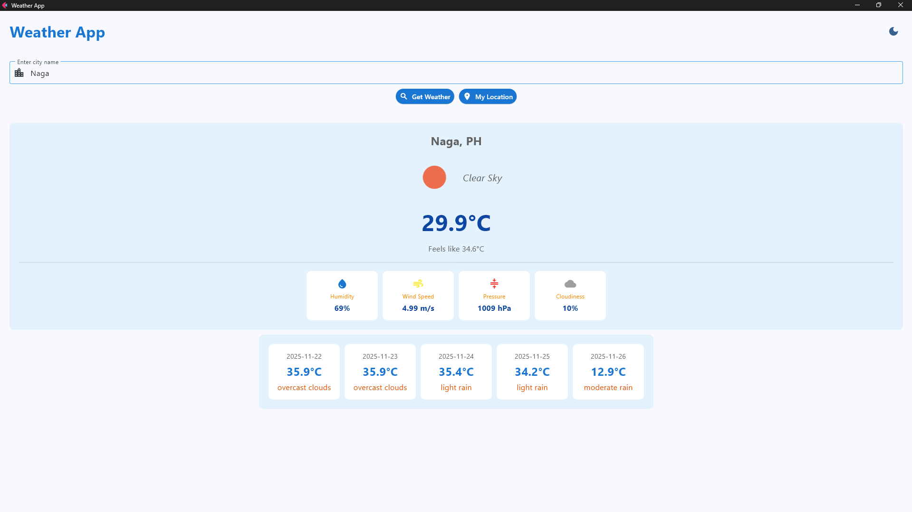
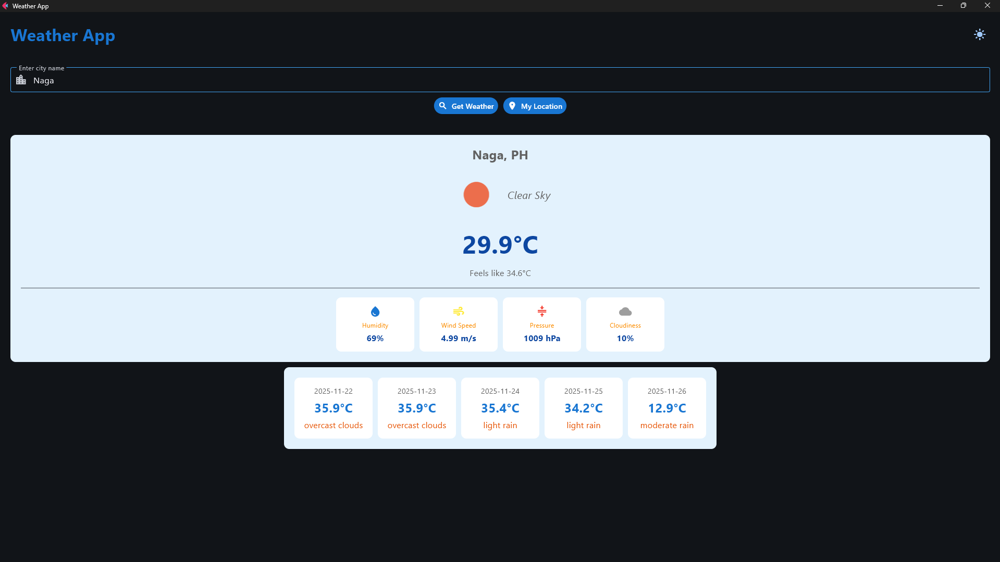
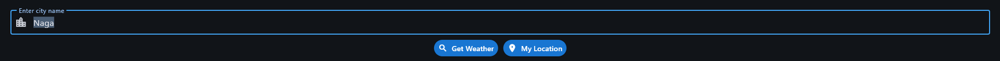
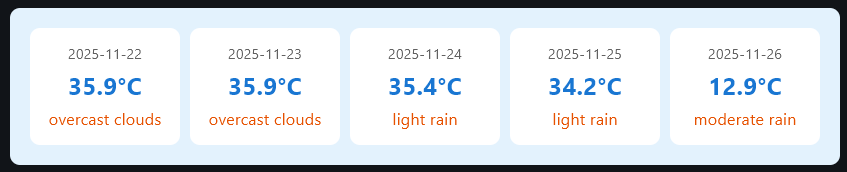

# Weather Application - Module 6 Lab

## Student Information
- **Name**: Deiven Joseph Pimentel
- **Student ID**: 231002335
- **Course**: CCCS 106
- **Section**: BSCS 2B

## Project Overview
This weather application is a Python-based weather forecast application built using Flet Framework and the OpenWeatherMap API.

## Features Implemented

### Base Features
- [x] City search functionality
- [x] Current weather display
- [x] Temperature, humidity, wind speed
- [x] Weather icons
- [x] Error handling
- [x] Modern UI with Material Design

### Enhanced Features
1. **Dark/Light Mode Toggle**
   - Description: Switch between a dark styled UI and light styled UI with a click of a button
   - Why: Easy to implement and provides better user experience
   - Challange: Balancing and finding good color combinations

2. **5day Forecast**
   - Description: Shows weather forecasts 5 days ahead
   - Why: So that users can plan ahead and already expect incoming weather ahead of time
   - Challenge: Figuring out how to group all the data

3. **Current Location Weather**
   - Description: Automatically gets the location of the user using IP-based geolocation to detect user's city
   - Why: To provide better user experience to the user
   - Challenge: None

## Screenshots
- #### Light Mode
 

- #### Dark Mode
 

- #### Current Location Weather
 

- #### 5-day Forecast
 

## Installation

### Prerequisites
- Python 3.8 or higher
- pip package manager

### Setup Instructions
```bash
# Clone the repository
git clone https://github.com/0xDei/cccs106-projects.git
cd cccs106-projects/mod6_labs

# Create virtual environment
python -m venv venv
source venv/bin/activate  # On Windows: venv\Scripts\activate

# Install dependencies
pip install -r requirements.txt

# Create .env file
cp .env.example .env
# Add your OpenWeatherMap API key to .env