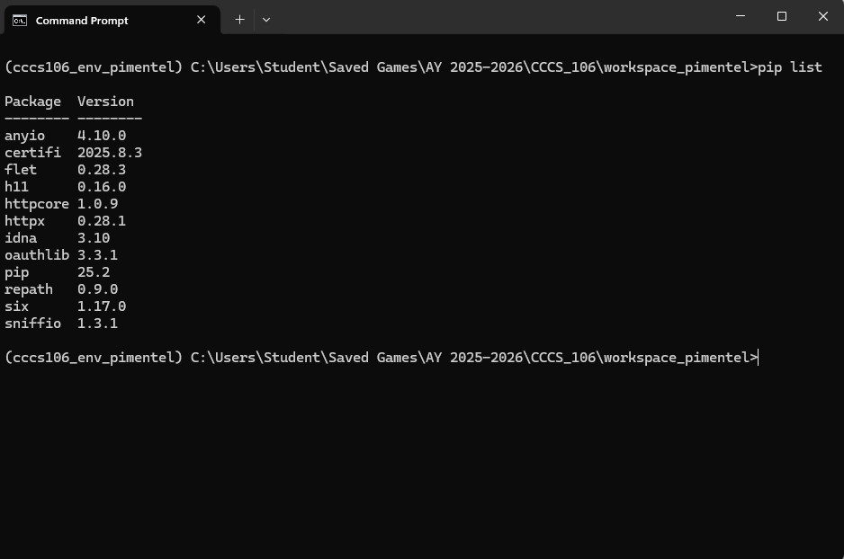
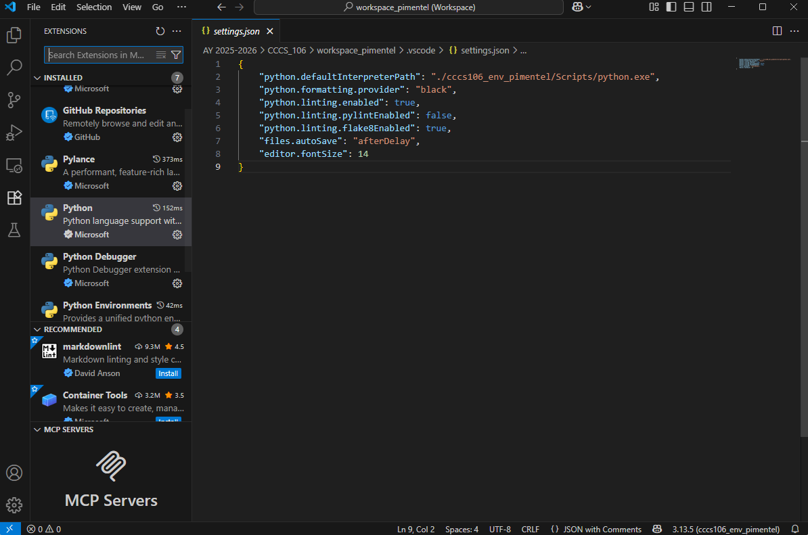
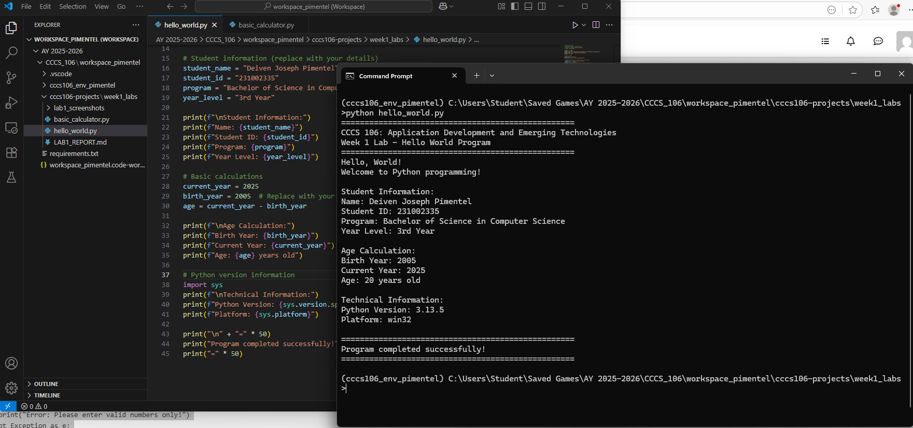
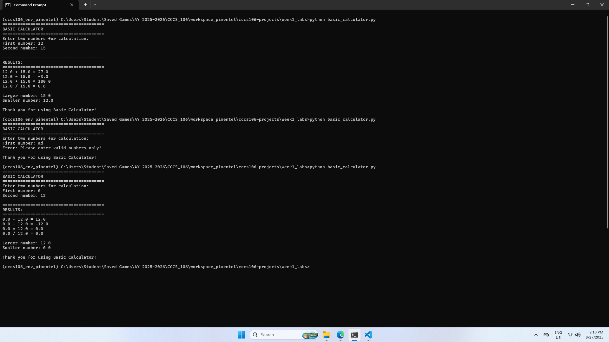

# Lab 1 Report: Environment Setup and Python Basics

**Student Name:** Deiven Joseph Pimentel
**Student ID:** 231002335
**Section:** BSCS 3B
**Date:** 8/27/2025

## Environment Setup

### Python Installation
- **Python Version:** 3.13.5
- **Installation Issues:** No problems
- **Virtual Environment Created:** ✅ cccs106_env_pimentel

### VS Code Configuration
- **VS Code Version:** 1.103.2
- **Python Extension:** ✅ Installed and configured
- **Interpreter:** ✅ Set to cccs106_env_pimentel/Scripts/python.exe

### Package Installation
- **Flet Version:** 0.28.3
- **Other Packages:** 
  - anyio
  - certifi
  - 11
  - httpcore
  - httpx
  - idna
  - oauthlib
  - pip
  - repath
  - six
  - sinffio

## Programs Created

### 1. hello_world.py
- **Status:** ✅ Completed
- **Features:** Student info display, age calculation, system info
- **Notes:** [None]

### 2. basic_calculator.py
- **Status:** ✅ Completed
- **Features:** Basic arithmetic, error handling, min/max calculation
- **Notes:** [None]

## Challenges and Solutions

Creating and setting up the Python environment and VS Code was pretty smooth in my experience and I did not encounter any issues.

## Learning Outcomes

I have learned to create a python environment and on how to change the interpreter path

## Screenshots
- #### Environment Setup
 

- #### VS Code Setup
 

- #### Hello World Output
 

- #### Basic Calculator Output
 