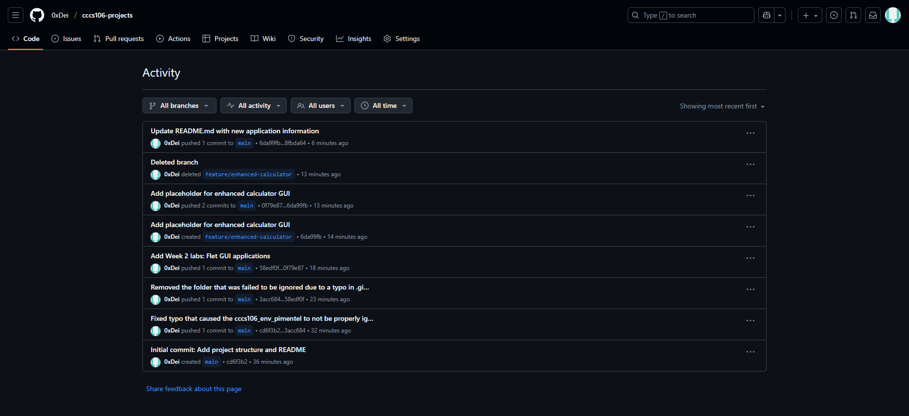
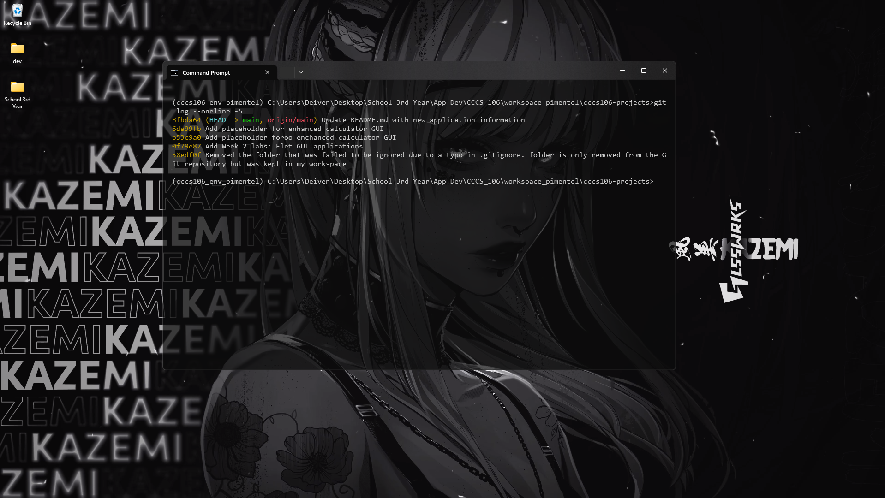
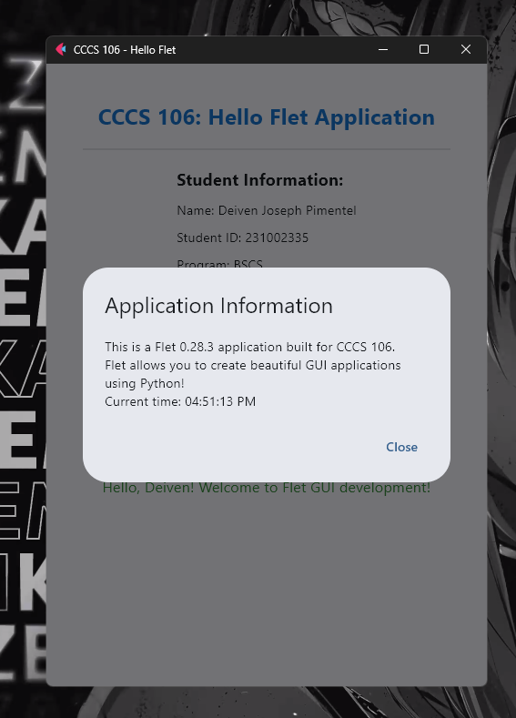
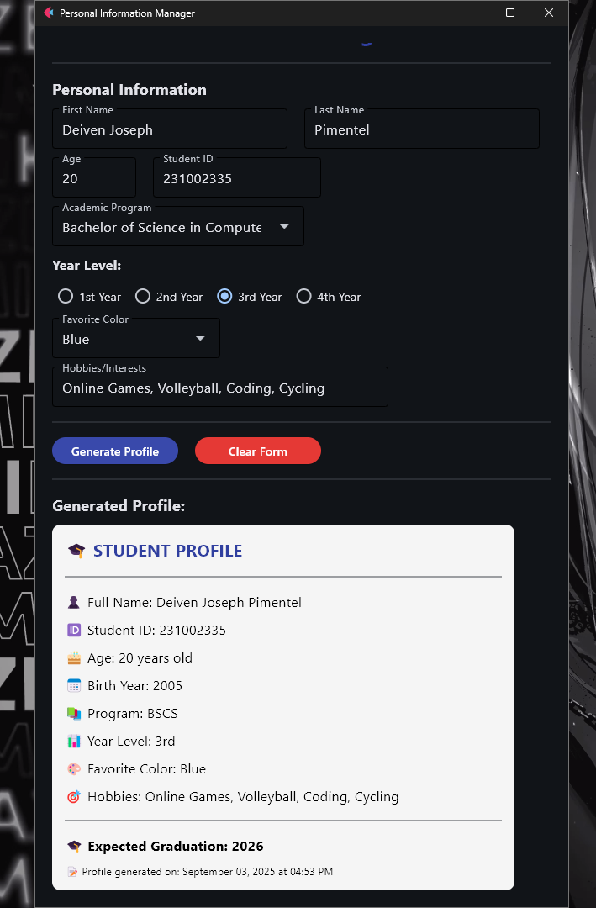

# Lab 2 Report: Git Version Control and Flet GUI Development

**Student Name:** Deiven Joseph Pimentel 
**Student ID:** 231002335 
**Section:** BSCS - 3B 
**Date:** September 3, 2025 

## Git Configuration
### Repository Setup
- **GitHub Repository:** https://github.com/0xDei/cccs106-projects
- **Local Repository:** ✅ Initialized and connected
- **Commit History:** [9] commits with descriptive messages

### Git Skills Demonstrated
- ✅ Repository initialization and configuration
- ✅ Adding, committing, and pushing changes
- ✅ Branch creation and merging
- ✅ Remote repository management

## Flet GUI Applications
### 1. hello_flet.py
- **Status:** ✅ Completed
- **Features:** Interactive greeting, student info display, dialog boxes
- **UI Components:** Text, TextField, Buttons, Dialog, Containers
- **Notes:** *Needed to add another line of code to make the info dialog show*

### 2. personal_info_gui.py
- **Status:** ✅ Completed
- **Features:** Form inputs, dropdowns, radio buttons, profile generation
- **UI Components:** TextField, Dropdown, RadioGroup, Containers, Scrolling
- **Error Handling:** Input validation and user feedback
- **Notes:** *Was having trouble reading the generated student profile due to the chosen color so I had to change the color to black to make it more readable*

## Technical Skills Developed
### Git Version Control
- Understanding of repository concepts
- Basic Git workflow (add, commit, push)
- Branch management and merging
- Remote repository collaboration

### Flet GUI Development
- Flet 0.28.3 syntax and components
- Page configuration and layout management
- Event handling and user interaction
- Modern UI design principles

## Challenges and Solutions
- *None*

## Learning Outcomes
*I learned alot, especially about how projects are managed using git and how useful it is when there are a lot of people working on the project at the same time.*

## Screenshots
### Git Repository
- [x] GitHub repository with commit history

- [x] Local git log showing commits

### GUI Applications
- [x] hello_flet.py running with all features

- [x] personal_info_gui.py with filled form and generated profile

## Future Enhancements
*I think it would be better if the GUI's were responsive and more feature packed*